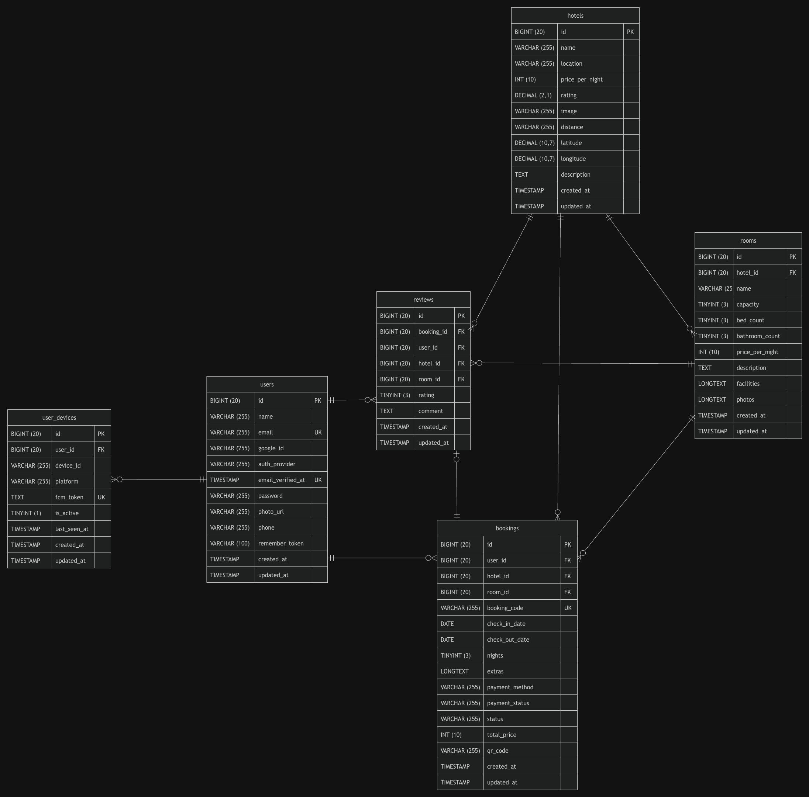
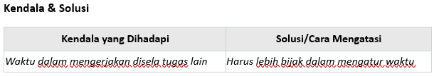

PiliHotel adalah aplikasi pemesanan (booking) hotel berbasis mobile yang dirancang untuk memudahkan pengguna dalam mencari hotel, memesan kamar secara real-time, mengelola profil, memberikan review, serta mendapatkan tiket booking berformat PDF.

Aplikasi ini menggunakan arsitektur Client-Server dengan memisahkan bagian Backend (Laravel) dan Frontend Mobile (Flutter).

-------------------------------------------------------------------------------------------------------------

# Fitur Utama

1. Autentikasi Pengguna & Keamanan:
   - Registrasi dan login akun dengan validasi aman.
   - Login dengan Google Auth.
   - Fitur ganti kata sandi langsung dari aplikasi.
   - Keamanan API menggunakan token dengan Laravel Sanctum.

2. Eksplor Hotel & Lokasi:
   - Cari dan jelajahi berbagai daftar hotel beserta ketersediaan kamarnya.
   - Lihat ulasan (reviews) dan rating dari pelanggan lain.
   - Pencarian hotel terdekat (nearby hotels).

3. Sistem Pemesanan (Booking) Kamar:
   - Pilih kamar dan lakukan pemesanan secara instan.
   - Pembayaran pemesanan (booking payment).
   - Cetak / unduh e-tiket pemesanan dalam format PDF.

4. Ulasan & Review:
   - Kirim review serta rating untuk hotel/kamar yang telah dipesan.
   - Unggah foto saat memberikan ulasan.

5. Manajemen Profil:
   - Ubah informasi profil pengguna.
   - Unggah foto profil.
   - Integrasi Firebase Cloud Messaging (FCM) Token untuk mendukung notifikasi perangkat.

-------------------------------------------------------------------------------------------------------------
# Entity Relationship Diagram (ERD)

-------------------------------------------------------------------------------------------------------------
# Link Figma

https://www.figma.com/design/6ffDYiLvh1E6GKlVT8BSFO/PBP-HOTEL-6--NEW-?node-id=1-1180&t=g0xuiy2K29Cr9zoY-1

-------------------------------------------------------------------------------------------------------------

#  pembagian tugas & tanggung jawab setiap fungsional

-------------------------------------------------------------------------------------------------------------

#   kendala & solusi

